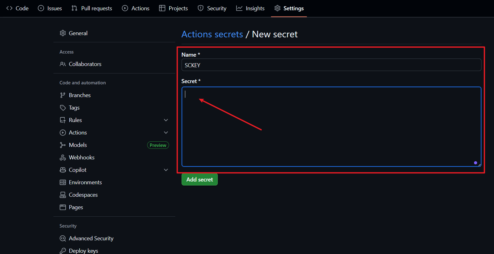

# 🔥 CVE Push Service | 自动化高危漏洞情报推送

<p align="center">

  </a>
  </a>
  

</p>

> ⚡ 面向网络安全从业者的 **高危漏洞实时情报推送工具**  
> 自动拉取 NVD 最新漏洞数据，筛选 **CVSS ≥ 7.0** 的高危漏洞，并通过 **[Server酱3](https://sc3.ft07.com/)** 第一时间推送到您的设备，帮助您在应急响应等场合中抢占先机。  

---

## 🚀 功能亮点

- ✅ **实时监控**：自动获取 [NVD](https://nvd.nist.gov/) 最新漏洞情报  
- ✅ **高危筛选**：仅推送 **CVSS ≥ 7.0** 的高风险漏洞  
- ✅ **智能翻译**：集成有道翻译 API，支持漏洞描述中文化  
- ✅ **多渠道推送**：支持通过 Server酱、钉钉、邮箱多种方式推送漏洞信息  
- ✅ **报告生成**：自动生成每日漏洞报告，按年/周-日期格式归档存储  
- ✅ **去重存储**：使用 Artifact 存储数据库，避免重复推送  
- ✅ **日志管理**：支持日志文件轮转，方便审计与追溯  
- ✅ **自动化运行**：支持 GitHub Actions 定时任务，方便省心，0 运维成本

---

## 🛠️ 使用方法

### 本地测试（可选）

如果您想在本地环境中测试和运行该项目，可以参考以下步骤：

1. **环境变量配置**：
   - 项目根目录提供了 `.env.example` 文件，包含所有需要的环境变量配置示例
   - 将 `.env.example` 文件复制并重命名为 `.env`
   - 编辑 `.env` 文件，填写您的实际配置信息
   - **注意**：`.env` 文件包含敏感信息，请确保它已添加到 `.gitignore` 中

2. **安装依赖**：
   ```bash
   pip install requests serverchan_sdk python-dotenv
   ```

3. **运行程序**：
   ```bash
   python CVE_PushService.py
   ```

详细的本地测试指南，请参阅项目根目录下的 `LOCAL_TEST_GUIDE.md` 文件。

---

### 1. 准备工作
- Star 本项目 （舍友说每多10个⭐，就请我吃一顿猪脚饭，助梦瘦弱男大吃猪脚饭🙏）
- Fork 本项目，Fork 后你的账号下会存在一个同样的项目（接下来的操作将在你自己的项目中进行）


- 直接从手机应用商店搜索`Server酱`下载安装，或访问 [Server酱3](https://sc3.ft07.com/) 点击APP下载。
- 下载app后注册账号，登录官网 [Server酱3](https://sc3.ft07.com/) 微信扫码后即可获取`SendKey`


### 2. 配置推送方式

本仓库已内置 GitHub Actions 工作流（[AutoCVE.yml](./workflows/AutoCVE.yml) ）。
你可以在仓库 Settings → Secrets 中配置以下变量（根据你需要的推送方式选择配置）：

**Server酱推送配置（原功能）：**
- SCKEY : 你注册的 Server酱3 SendKey（注意！前后不要有空格回车）

**钉钉推送配置：**
- DINGTALK_WEBHOOK : 钉钉机器人的Webhook地址

**邮箱推送配置：**
- EMAIL_SMTP_SERVER : SMTP服务器地址（例如：smtp.qq.com）
- EMAIL_SMTP_PORT : SMTP服务器端口（默认：587）
- EMAIL_USERNAME : 发件人邮箱地址
- EMAIL_PASSWORD : 发件人邮箱密码/授权码
- EMAIL_RECEIVER : 收件人邮箱地址




### 3. GitHub Actions 自动化运行

- 点击 `Actions` 进入运行页面，点击 `I understand my workflow` 按钮。
- 自动刷新后左侧出现 `Auto CVE Push Service` 流程。
- 点击 `Auto CVE Push Service` 流程，点击 `Enable Workflow` 按钮。
- 给自己的项目点击两次 `Star` （Fork后你自己的项目）启动Action。
- 再点击上面的 `Actions` 选择 `Auto CVE Push Service` 看看有没有报错。
- 没有报错的话Server酱里应该就会有推送通知了（记得打开Server酱App通知权限）
- 推推送效果示例：

<p align = "center">

</p>
<p align = "center"> 


</p>

### 注意

- 默认是每天早上 **北京时间 7:30**左右开始自动检测**24小时**内是否有新的高危漏洞曝出，如果您想修改，可以在AutoCVE.yml中修改。实际执行时间：每天上午 ≈7:00~8:00（受GitHub队列影响）
- 由于本项目中使用 `GitHub Actions` 的 `Artifact` 来存储数据库（vulns.db）。`Artifact`是存储在GitHub仓库的`Actions`页面下的，与代码仓库分离。因此，当你们fork项目时，只能复制代码，但不会复制`Artifact`。这意味着：
  - 每个fork的项目在首次运行时，由于没有历史数据库，会从头开始创建一个新的`vulns.db`。（APP可能会收到24小时内的多条通知，不要惊慌）
  - 每个fork的项目在后续运行中，会使用自己工作流生成的`Artifact`（即自己保存的数据库），不会互相影响。
- 运行方式：
   - 启动 Action 时自动首次触发，后续工作流会在每日北京时间 7:30 左右自动运行
   - 或手动触发测试：Actions → Auto CVE Monitor → Run workflow
---

<p align="center">⚡ 如果本项目对你有帮助，请点一个 ⭐ Star 支持作者！</p> 

---

## 📅 更新日志

> 目前仅为示例，后续持续完善
- 2025-09-01 ✅️ 优化自动执行时间
- 2025-08-31 🎉 首次发布：支持高危漏洞自动推送，集成 GitHub Actions

> TODO:
- 🔲 增加漏洞分类标签
- 🔲 针对已曝出漏洞实时跟踪全网 POC/EXP 情况，自动通知。

---

## 💾 报告存储格式

项目会自动生成每日漏洞报告，并按照以下目录结构存储：
```
data/YYYY/W-WWDD/daily.md
```

- **YYYY**: 年份，例如：2025
- **WW**: 周数，例如：37
- **DD**: 日期，例如：13

示例路径：`data/2025/W37-0913/daily.md`

生成的报告包含当天所有高危漏洞的详细信息，按CVSS评分分组展示。

## 📦 GitHub Release 发布

当发现新的漏洞时，系统会自动将报告打包并发布为GitHub Release：

- **Tag格式**：`YYYY-MM-DD_DailyPush`（例如：`2025-09-13_DailyPush`）
- **打包内容**：`data/`目录下的所有文件，以`tar.gz`格式压缩
- **访问方式**：可在项目的Releases页面下载完整报告包

这一功能使得漏洞报告可以长期保存，方便用户随时查阅历史漏洞信息。

## 💡 致谢

- 感谢 [kiang70](https://github.com/kiang70/Github-Monitor/)、[Kira-Pgr](https://github.com/Kira-Pgr/Github-CVE-Listener)两位师傅提供思路。
- 感谢 [Server酱3](https://sc3.ft07.com/) 提供稳定的消息推送服务。
- 感谢 [NVD](https://nvd.nist.gov/) 提供权威的漏洞情报源。
- 翻译由 **有道开放平台** 提供。


